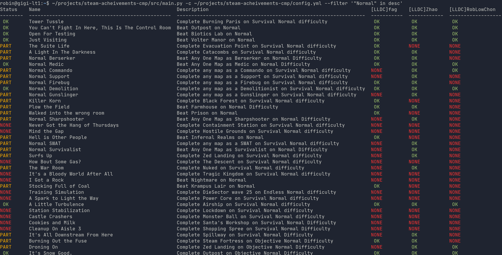
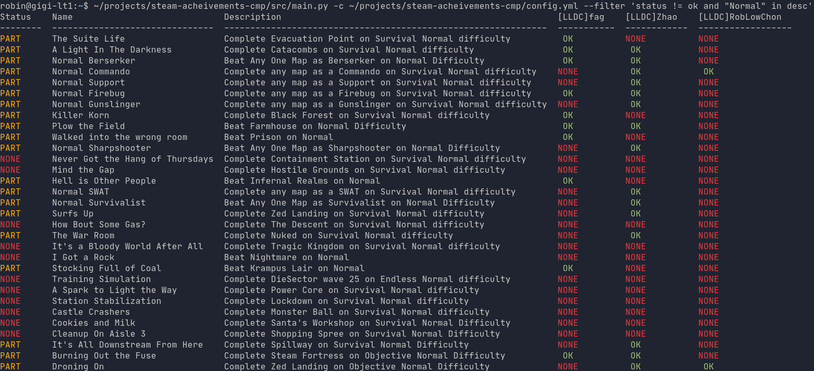

# Compare player achievements

This script finds and compare achievements for multiple players. This allows to find common missing achievements for cooperative games.

Killing Floor 2 examples:

_Finds all achievements containing "Normal"_

_Finds all achievements containing "Normal", and not achieved by at least one player_

# Prerequisites

All players `Game details` privacy setting must be set to `Public`:
- Go to https://store.steampowered.com/
- Log in
- Click on your profile picture in the top right corner
- Click on `Edit profile`
- Go to `Privacy Settings`
- Change `Game details` to `Public`

# Configuration

See [`config_example.yml`](./config_example.yml) for a config file example.

- Get a [Steam Web API Key](https://steamcommunity.com/dev/apikey), and set it to `config.yml`
- Get your friends Steam IDs and set them to `config.yml`. To do so, got to their profile page, and copy the number from the URL (`https://steamcommunity.com/profiles/xxxxxxxxxxxxxxxxxxxxxx/`)
- Find your game id (`https://store.steampowered.com/app/xxxxxxx/.../`), and set it to `config.yml`
- Optionally change the language in `config.yml`

# Usage

See `src/main.py --help`.

`--filter` is evaluated using Python 3's `eval` function. Any Python 3 syntax is allowed there.

The available fields for filtering are:
- `status` the overall status for all the players
  - `ok`: All players unlocked the achievement
  - `part`: (Partial) At least one player unlocked it, but at least one did not
  - `none`: None of the players unlocked this achievement
- `name` the achievement name
- `desc`/`description` the achievement description
